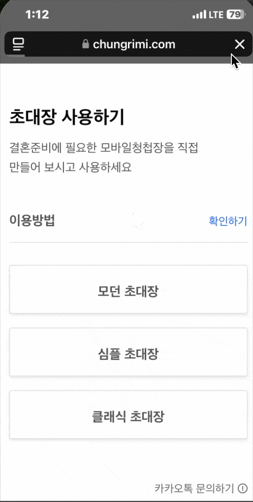

## 🎉 모바일 청첩장 

2025년, 결혼식 비용이 너무 비싸 내가 과연 결혼을 할 수 있을까 고민이 들던 시기였습니다.

그때 문득, 
#### **“차라리 내가 직접 청첩장을 만들어 보면 어떨까?“**
라는 생각이 떠올랐습니다.

기왕 만드는 김에, **누구나 무료로 사용할 수 있도록 공유한다면 더 의미 있지 않을까** 싶었습니다.

이 프로젝트는 그러한 고민과 아이디어에서 출발했으며, 

포트폴리오와 오픈소스를 겸한 결과물입니다.
디자인을 즐기거나 개발에 관심 있는 분들이 자유롭게 활용하고, 기여할 수 있도록 제작되었습니다.


vue 와 scss, css로 이루어진 프로젝트입니다 
kakaoAPI, googleMapAPI, ghpage, emailJs 등의 오픈API가 사용되었습니다.

---

## 🌟 주요 기능

### 1. 스와이프 형식의 템플릿 탐색
메인 페이지에서 다양한 초대장 템플릿을 스와이프 방식으로 탐색할 수 있습니다.  
원하는 템플릿을 클릭하면 해당 템플릿의 세부 정보를 확인할 수 있습니다.

_<small>#현재 템플릿 1개만 제작되어있습니다</small>_


_<small>#템플릿 스와이프 및 클릭 예시</small>_

### 2. 개발자 직접 문의
- 메인 페이지 하단의 KakaoTalk 아이콘을 통해 개발자와 바로 소통할 수 있습니다.
- 이 프로젝트의 전체 소스 코드를 GitHub에서 확인할 수 있습니다.

### 3. 템플릿 전용 페이지 제공
해당 페이지는 별도의 쿼리 파라미터로 분리되어 있어, 특정 템플릿만 보여주는 링크를 복사해 공유할 수 있습니다.


_<small>#템플릿 상세 설명 및 링크 복사 예시</small>_

---

## 🚀 프로젝트 사용법 [](https://hits.seeyoufarm.com)


1. **원하는 템플릿 탐색**: 메인 페이지에서 스와이프 방식으로 템플릿을 탐색하세요.
2. **템플릿 확인 및 공유**: 원하는 템플릿을 클릭해 세부 정보를 확인하고, 공유 링크를 복사하세요.
3. **소스 코드 탐색**: 프로젝트 코드를 확인하거나 수정을 원하시면 GitHub 저장소를 방문하세요.

---

## 📦 설치 방법

1. 이 저장소를 클론합니다.
   
   ```bash
   git clone https://github.com/your-username/your-repo.git

3. 디렉토리로 이동한 뒤, 패키지를 설치합니다.
   
   ```bash
   cd your-repo
   npm install
   
5. 로컬 서버를 실행합니다.
   
   ```bash
   npm run dev
   npm run dev -- --host

---

## 💡 API 키 설정

본 프로젝트에서 **카카오톡 JavaScript SDK**와 **EmailJS** 서비스를 개인으로 사용하려면 각각의 API 키를 설정해야 합니다.

### 📝 설정 방법:

1. **카카오톡 API 키**:
   - 카카오톡 JavaScript SDK를 사용하려면 [카카오 개발자 사이트](https://developers.kakao.com/)에서 본인의 애플리케이션을 생성한 후, JavaScript SDK 키를 발급받으세요.
   - 발급받은 API 키는 `.sample.env` 파일의 이름을 `.env` 로 바꾼 뒤 `VITE_KAKAO_API_KEY`에 입력하세요.
     <br><br>
   ```bash
   VITE_KAKAO_API_KEY=여기에 카카오톡 JavaScript SDK 키를 입력하세요

1. **EmailJS API 키**:
   - EmailJS를 사용하려면 [EmailJS 홈페이지](https://www.emailjs.com/)에서 회원가입 후, API 키를 발급받으세요.
   - 발급받은 API 키는 `.sample.env` 파일의 이름을 `.env` 로 바꾼 뒤 `VITE_EMAILJS_API_KEY`에 입력하세요.
     <br><br>
   ```bash
   VITE_EMAILJS_API_KEY=여기에 EmailJS SDK 키를 입력하세요 (예: YYYYYYYYYYYYYYYY)

위의 설정이 완료되면, 프로젝트에서 카카오톡 SDK와 EmailJS 기능을 정상적으로 사용할 수 있습니다!
   
